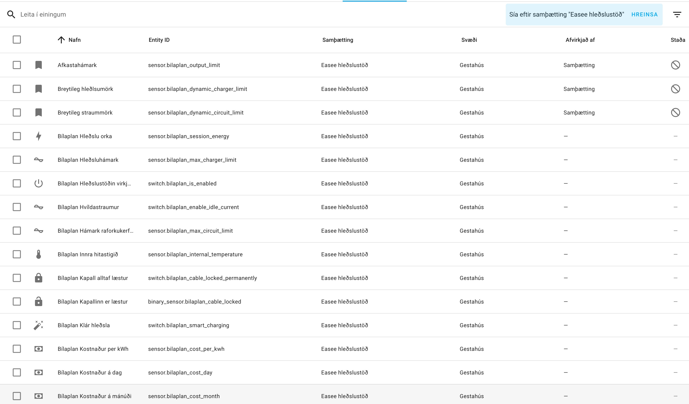
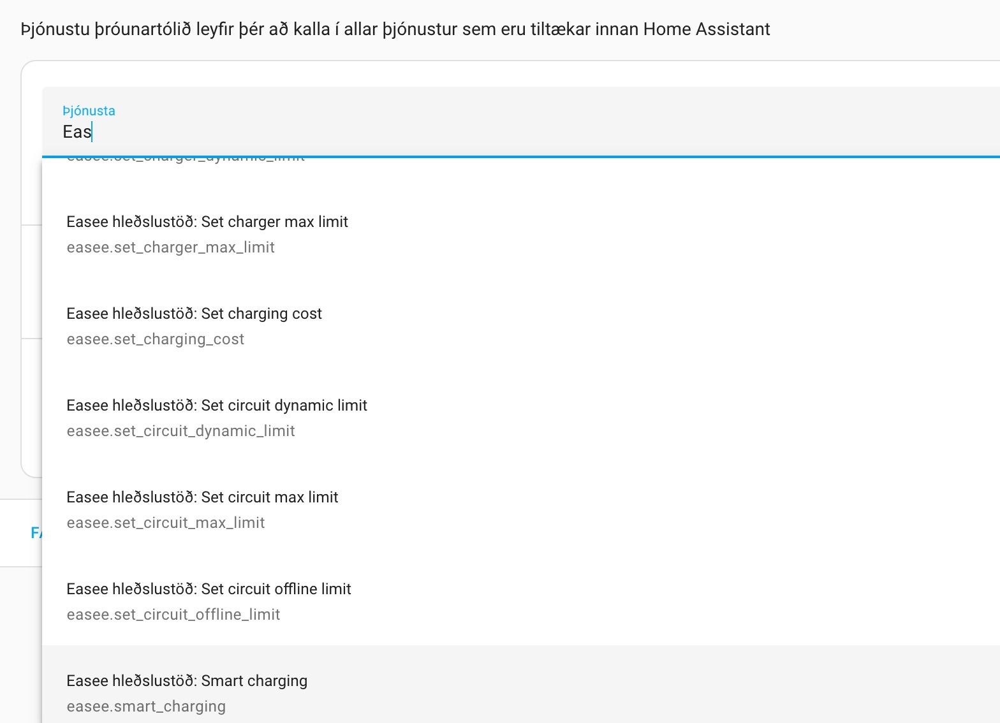
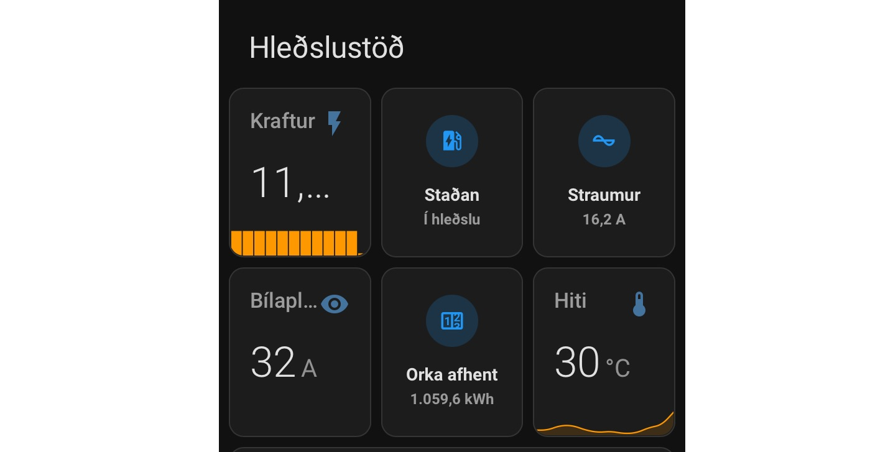
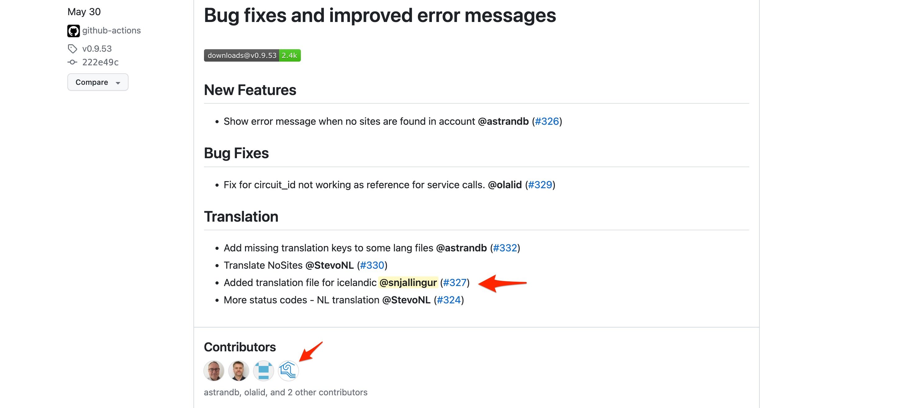

# Snjall Hleðslustöð

Hleðslustöðvar mega ekki vera undanskilin á snjallheimilinu. Ávinningurinn felst í því að geta fylgst með hleðslunni á rafmagnsbílum og fá tilkynningu hvenær hleðslan hefst eða hefur verið lokið. 
Sumir rafmagnsbílar bjóða fram á svipaðra virknina en fyrir bílaflotann þar sem þessi þjónusta er ekki í boði er mikill kostur og hafa snjalla hleðslustöð sem getur frætt mann um ýmislegt.
Í þessum pistill förum við yfir eina slíka og sýnum fram á hvernig við getum fengið allar upplýsingar inn í Home Assistant hússtjórnunarkerfið. Svo förum aðeins inn á það hvað þarf að hafa í huga varðandi uppsetningu og val á hleðslustöð ef hún á að vera kölluð snjallt.

<!-- more -->

## Val á hleðslustöð

Þegar komið að því að velja hleðslustöð þá er margt sem þarf að hafa í huga. Það er orðið gríðarleg úrval á hleðslustöðum, söluaðilum og uppsetninga aðilum sem allir hafa sína "uppáhaldsstöð" sem þeir þekkja best. Það er gott að fara yfir nokkur mál við valinu.

+ Traustur uppsetningaraðili sem þekkir stöðina út og inn og ber ábyrgð á fagmannlegu uppsetningu. Listi yfir samþykkta og löggiltra uppsetninga aðila má m.a. finna á [heimasíðu SART](https://sart.is/index.php/thjonustuadhilar/leitarvel/search/results)
+ Veðurþol fyrir íslenska aðstæður
+ Hleðslugetu upp á 22KW. Kannski ekki alltaf nauðsynlegt þar sem margir bílar taka einungis 11KW. En betra að vera framtíðarhæft.
+ Innbyggt WiFi til að tengja hana við heimanetið
+ 4G. Þannig næ ég samband við hana þó að WiFi er ekki til staðar
+ Aðgangsstýring í gegnum RFID lykil. Mjög mikilvægt ef við viljum ekki að allir geta hlaðið og maður þarf ekki alltaf að taka upp símann til að geta hlaðið
+ App í símann fyrir Android og Iphone
+ Stuðningur við Home Assistant
+ Stuðningur fyrir álagsstýring ef á að setja upp fleiri en eina á sömu grein (t.d. fyrir fjölbýli)
+ Orkumæling. Þannig vitum við betur hver raunkostnaðurinn er

Fyrir valið á hleðslustöð var [hleðslustöð frá Eassee](https://hledslustodin.is/product/easee-home-hledslustod/). Hún tikkaði í öll box hér að ofan


## Samþætting við Home Assistant

Þegar stöðin var komin upp, var næsta skrefið auðvitað að koma upplýsingunum í Home Assistant. Eins og oft áður hefur einhver leyst þetta vandamál og birt tengingu við Easee appið sem er auðvelt í uppsetningu. Upssetnignarleiðbeiningar fyrir Home Assistant má finna á [Gihub síðunni frá Niklas Fondberg](https://github.com/fondberg/easee_hass). Eini pínulítli gallinn er sá að tengingin þarf að fara fara fram í gegnum [skýjalausninni frá Easee](https://easee.cloud/). En uppsetningin gékk snúrlaust fyrir sig og þegar hún er virk þá getum við fengið alls konar upplýsingar inn í Home Assistant.



Að auki fáum við möguleiki að kalla á alls konar skipunum til að stjórna hleðslustöðinni beint úr Home Assistant.



Mikilvægasta aðgerðin hér er sennilega möguleikinn að hefja (start), hætta (stop) hleðslu og gera hlé (pause) á hleðslu beint úr Home Assistant. Til þess þurfum við að búa til skriftu sem kallar á þjónustuna `#!python easee.action_command` .

``` { .yaml .copy .linenums}
service: easee.action_command
data:
  device_id: xxxxyyyzzz
  action_command: start
```

Við getum notað upplýsingarnar til að búa til falleg skjáborð eða búa til fallegt sýn fyrir hleðslustöðinni í núvernadi skjáborð. Ég nota oftast nær sveppa einingarnir þar sem mér finnst þá fallegast og eru afar einfalt í notkun.



### Stöðugildi á íslensku

Eitt af því sem er frábært við Github, er að allir geta tekið þátt, hjálpast að, og gera góða hluti enn betra. Eitt sem fór aðeins í taugana hjá mér við Easee samþættinguna frá Niklas var að allar stöðumeldingar voru á ensku. Þannig tók ég mig til og bætti íslensku þýðinguna við. Með git/Github er einfalt að gera beiðni um breytingu á kóðanum (kallast pull request). Síðan er beiðnina með breytingunum samþykkt inn í kóða (það kallast merge) og með því njóta allir sem uppfæra sig í útgáfuna 0.9.53 íslensku þýðinguna.



Þar með hefur Snjallingur hjálpað öðrum notendum og njóta samþættinguna á íslensku.